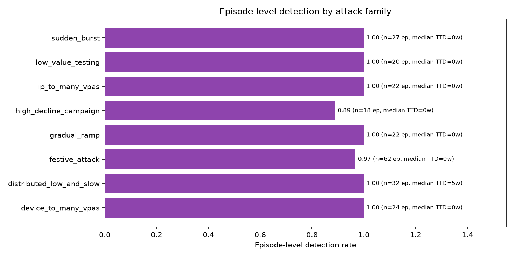
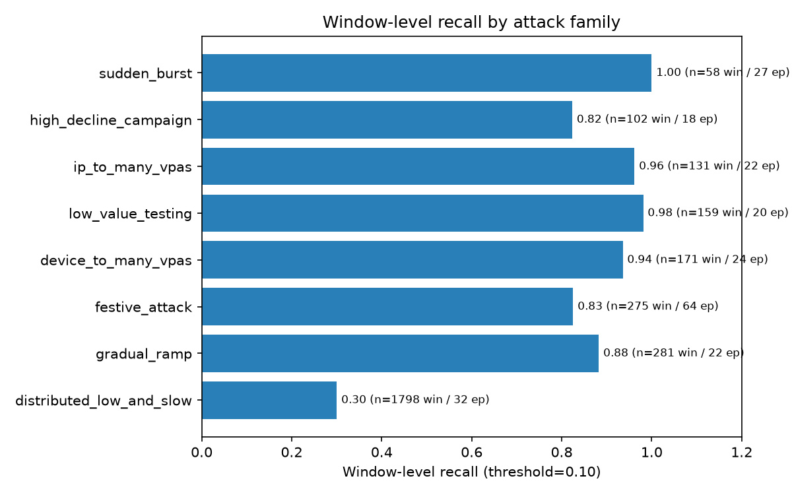
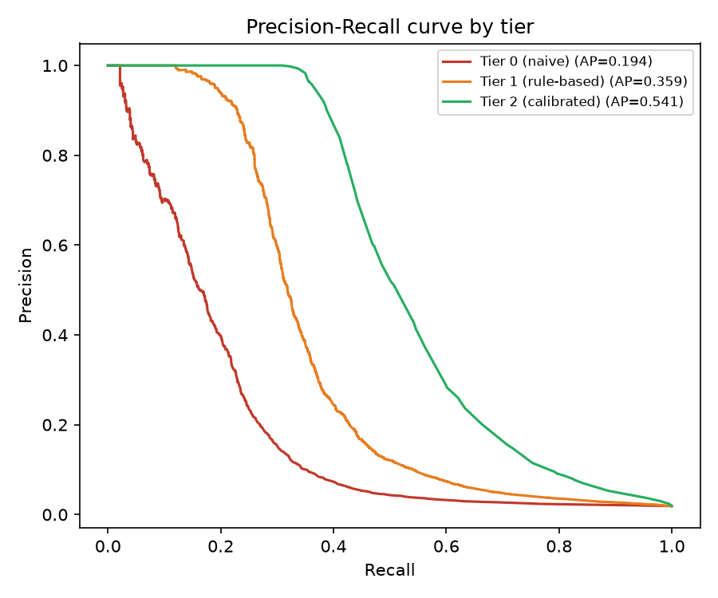
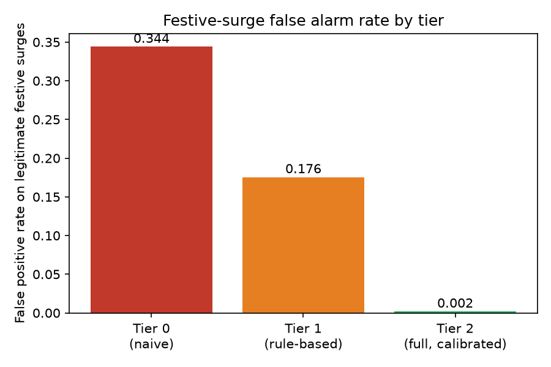
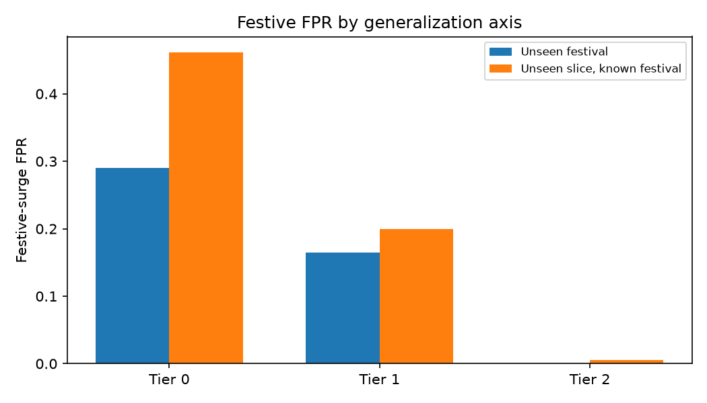
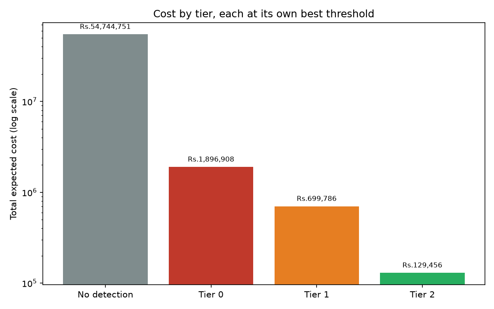
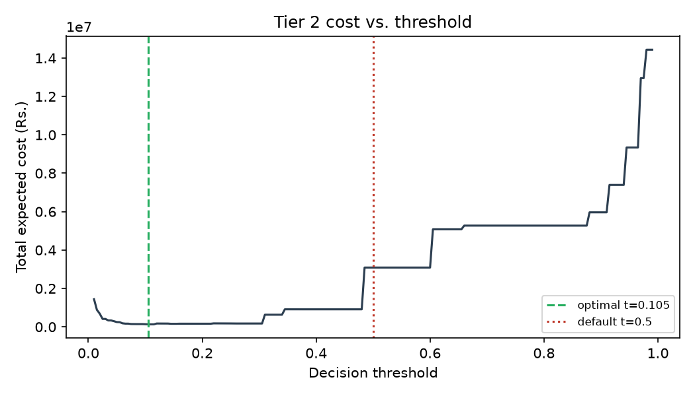
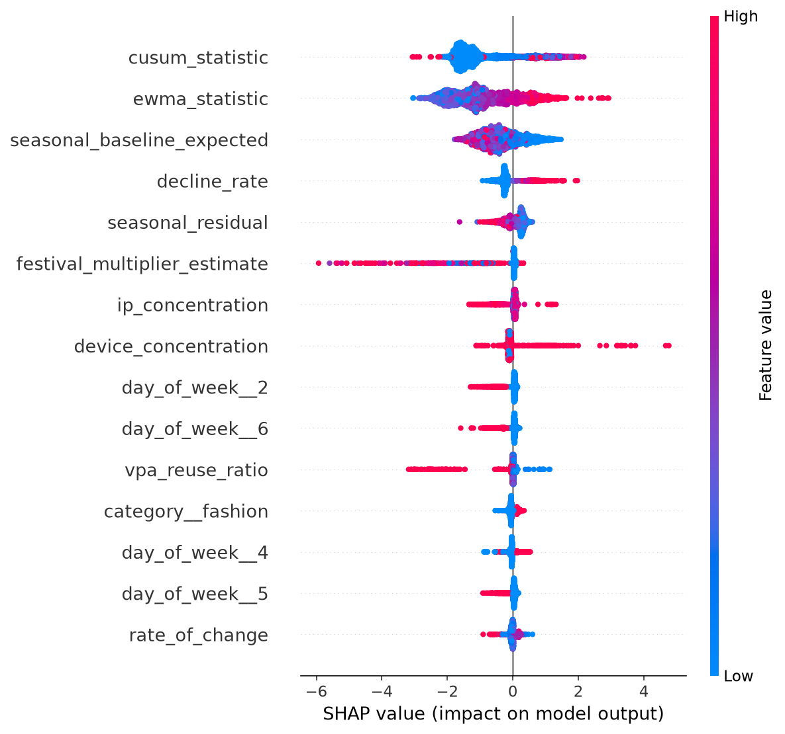

# SurgeShield: UPI fraud-spike detection for festive surges

At its cost-optimal threshold, the full model cuts the false-alarm rate on legitimate festive traffic from 34.4% (naive volume threshold) to 0.19%, while still catching 96 to 100% of six of eight attack patterns at the episode level. Total expected cost on the test set drops from an estimated Rs 5.47 crore with no detection to Rs 1.29 lakh, a 423x reduction.

This repository contains the synthetic data generator, the three-tier detection pipeline, and the review dashboard behind those numbers.

## The problem

A UPI merchant's transaction volume during Diwali or Independence Day sales can jump 3 to 6x overnight. Decline rates also rise, because payment infrastructure strains under load. Both of those look, on paper, like the early signature of a fraud campaign: a sudden spike in volume and a rise in failed transactions. A detector that just watches for volume or decline anomalies will flag every big sale a merchant runs, and a risk team that gets buried in false alarms during the exact weeks that matter most will start ignoring the tool.

The actual fraud that shows up during these windows has a different fingerprint if you look at the right signals: card testing, device-to-many-VPA fan-out, and coordinated low-value probing all show up in which identities are transacting, how concentrated they are across devices and IPs, whether declines cluster around one reason code, and whether the current volume is unusual *after* accounting for the calendar. This project builds a detector around that distinction and measures, honestly, how well it holds up.

## Results

### Detection by attack pattern (episode-level)

An episode is one continuous attack campaign, whether it lasts 3 windows or 80. "Caught" means the detector flagged at least one window inside the episode.

| Attack family | Test episodes | Detection rate | Median time to first flag |
|---|---|---|---|
| high_decline_campaign | 18 | 0.89 | 0 windows |
| festive_attack | 62 | 0.97 | 0 windows |
| sudden_burst | 27 | 1.00 | 0 windows |
| low_value_testing | 20 | 1.00 | 0 windows |
| ip_to_many_vpas | 22 | 1.00 | 0 windows |
| gradual_ramp | 22 | 1.00 | 0 windows |
| device_to_many_vpas | 24 | 1.00 | 0 windows |
| distributed_low_and_slow | 32 | 1.00 | 5 windows (about 75 minutes) |



Every episode of every attack type gets caught eventually except two out of eighteen high_decline_campaign episodes. `distributed_low_and_slow` is the interesting case: it takes longer to flag than everything else, because by design each individual window looks almost normal. That's the point of a low-and-slow attack. The CUSUM/EWMA drift statistics are what eventually catch it, once enough slightly-elevated windows accumulate. See the window-level numbers below for what that trade-off costs.

### Detection by attack pattern (window-level, at the cost-optimal threshold)

| Attack family | Test windows | Episodes | Window-level recall |
|---|---|---|---|
| distributed_low_and_slow | 1,798 | 32 | 0.30 |
| festive_attack | 275 | 64 | 0.83 |
| high_decline_campaign | 102 | 18 | 0.82 |
| gradual_ramp | 281 | 22 | 0.88 |
| device_to_many_vpas | 171 | 24 | 0.94 |
| ip_to_many_vpas | 131 | 22 | 0.96 |
| low_value_testing | 159 | 20 | 0.98 |
| sudden_burst | 58 | 27 | 1.00 |



Most windows in a low-and-slow episode never individually cross the threshold on their own. The cumulative CUSUM statistic does, eventually, which is why episode-level detection stays at 1.00 even though window-level recall sits at 0.30. By design, `policy_engine.py` treats an elevated CUSUM as a step-up trigger on its own, without waiting for the underlying probability to clear the bar.

### Overall performance across the three tiers

| Tier | Precision | Recall | F1 | PR-AUC | FPR |
|---|---|---|---|---|---|
| 0, naive (volume only) | 5.6% | 44.1% | 0.099 | 0.194 | 14.4% |
| 1, rule-based (fixed festival multiplier) | 7.9% | 58.7% | 0.139 | 0.359 | 13.3% |
| 2, full (calibrated) | 90.4% | 38.7% | 0.542 | 0.541 | 0.08% |



Numbers above are at each tier's raw 0.5 probability cutoff, to isolate what the model itself learned before any cost-based threshold tuning. Attacks make up about 1.9% of test windows, which is why precision at a fixed cutoff moves so much between tiers: small absolute changes in false-positive count swing precision hard at this base rate. Tier 2's operating point is chosen properly below, on the calibration split, not at the default 0.5.

### False alarms on legitimate festive surges

This is the number that actually matters for a merchant support team: how often does a real Diwali or Independence Day sale get mistaken for an attack.

| Tier | Overall | Unseen festival | Unseen merchant, known festival |
|---|---|---|---|
| 0, naive | 34.4% | 29.1% | 46.2% |
| 1, rule-based | 17.6% | 16.5% | 20.0% |
| 2, full (calibrated) | 0.19% | 0.02% | 0.56% |




The naive detector flags roughly one in three legitimate festive windows as fraud. The full model flags about one in five hundred, and it holds up almost as well on a festival it never saw during training as on one it did. That is the whole point of holding three festivals out entirely.

### Cost impact

Cost model: Rs 50 per false alarm (analyst review time), plus the estimated exposure of any episode that is never caught (average transaction amount times count times success rate, summed over the episode; an estimate, not a measured loss figure).

| Scenario | Total expected cost (test set) |
|---|---|
| No detection at all | Rs 54,744,751 |
| Tier 0, at its own best threshold | Rs 1,896,908 |
| Tier 1, at its own best threshold | Rs 699,786 |
| Tier 2, at its own best threshold (t = 0.105) | Rs 129,456 |



Tier 2 cuts expected cost by 423x against no detection, 14.7x against the naive tier, and 5.4x against the rule-based tier. Thresholds are chosen by sweeping cost on the calibration split and applying the result to test, not by tuning against test directly.



Tier 2 at the default 0.5 cutoff costs Rs 3,088,402, 24x worse than at its own tuned threshold of 0.105. The calibrated model's probabilities aren't centered where a naive 0.5 cutoff assumes they'd be.

Raw numbers behind every chart above are in `data/eval/` as CSVs (`cost_sweep.csv`, `recall_by_attack_family.csv`, `episode_level_detection_by_family.csv`) for anyone who wants to recompute or replot them directly.

## How it works

Three tiers, trained and evaluated identically so the comparison is fair:

- **Tier 0**: raw transaction count and its rate of change. No calendar awareness at all.
- **Tier 1**: the same, plus a fixed 3x multiplier applied uniformly to every festival window, regardless of category or which festival it is.
- **Tier 2**: an XGBoost classifier over decline rate and its dominant reason code, transaction amount statistics, device/IP/VPA concentration and reuse ratios, a per-slice walk-forward seasonal baseline, CUSUM and EWMA drift statistics computed against that baseline, and a per-(category, festival-phase) multiplier learned only from past clean festive windows. Probabilities are isotonic-calibrated on a held-out slice subset before any threshold is chosen.

The three-tier structure exists to answer a specific question honestly: how much of Tier 2's performance comes from the behavioral features and calibration, versus just knowing a festival is happening. The 0.194 to 0.359 to 0.541 PR-AUC progression is that answer.

## What the model actually learned



The SHAP summary puts `cusum_statistic` and `ewma_statistic` at the top. The model leans most heavily on sustained deviation from a slice's own seasonal-adjusted baseline, not on raw volume or a single window's spike size. That is consistent with what a naive detector gets wrong: a big single-window spike is exactly what a legitimate flash sale looks like too.

`vpa_reuse_ratio` shows a pattern worth calling out specifically. High reuse, the same payer IDs transacting repeatedly, pushes the prediction toward "not an attack." Low reuse, fresh identities on almost every transaction, pushes toward "attack." That matches the underlying fraud pattern by construction: card-testing and identity-fan-out attacks mint a new victim identity per attempt, while real repeat customers reuse the same VPA. That distinction wasn't hand-coded; the model picked it up directly from the raw ratio.

## What sets this apart

- Three-tier ablation, not a single accuracy number. The naive and rule-based tiers exist specifically so the value of the behavioral features and calibration step is measurable, not asserted.
- Two generalization axes tested separately: unseen merchant slices, and three entire festivals excluded from training outright. Most of the reported numbers are broken out both ways rather than blended into one holdout figure.
- Threshold selection is cost-based and split-honest. Thresholds are swept on the calibration slices, then applied unchanged to test, with the sensitivity to that choice (the 24x gap above) reported rather than hidden.
- Episode-level and window-level detection are both reported, because a fraud team cares about "did we ever catch this campaign" as much as per-window recall. The two numbers disagree in informative ways for `distributed_low_and_slow`.
- Attack windows in the underlying synthetic data are diluted with real concurrent legitimate traffic, not generated as attacker-only windows. A window under an active attack still contains the customer pool's own transactions and its own baseline decline behavior alongside the attacker's, so the separability reported above reflects genuinely mixed traffic rather than an artifact of clean attack-only windows.
- The evaluation pipeline and the live review dashboard run on the same inference code path (`feature_pipeline.py`, `policy_engine.py`). The demo is not a separate mockup of the numbers reported here, it calls the same functions.

## Limitations and future scope

- **Exposure is a proxy, not a measured loss.** `avg_amount * txn_count * (1 - decline_rate)` per episode is a reasonable stand-in for money at risk, but it is not settlement data. The cost numbers above should be read as directionally honest, not as an audited loss figure.
- **All data is synthetic.** The attack families, festival calendar, and customer behavior are simulated and calibrated to published aggregate patterns, not fit to a real merchant's transaction log. Real UPI traffic will have PSP-specific quirks, regional effects, and fraud tactics this generator does not model.
- **`distributed_low_and_slow` is the weakest pattern.** Window-level recall of 0.30 means a patient attacker who stays under the CUSUM drift threshold for long enough could extend the 5-window median detection time considerably. The current safety net (`policy_engine.py`'s CUSUM watch override) is a reasonable mitigation, not a solved problem.
- **Single training run.** Metrics reflect one seed, one train/calibration/test split. There is no cross-validation or confidence interval on any number in this README.
- **Dominant-signal explanations use fixed heuristic reference values** (`SIGNAL_REFERENCES` in `policy_engine.py`), not values learned or recalibrated from data. They are documented as heuristics in the code and should be treated as such.
- **The demo dashboard's login is a client-side gate**, adequate for a demo, not for a production deployment. API endpoints have no independent authentication.

Future scope: extend the attack taxonomy toward the other loss classes this track calls out (returns, chargeback disputes) as a shared risk platform; replace the exposure proxy with real settlement or refund data once available; retrain across multiple seeds to report confidence intervals instead of point estimates; and add real authentication and role-based access before any production use.

## How to run locally

Requirements: Python 3.10+, and `pandas`, `numpy`, `scikit-learn>=1.6` (required for `sklearn.frozen.FrozenEstimator`), `xgboost`, `shap`, `matplotlib`, `joblib`, `pyarrow`, `fastapi`, `uvicorn`.

```bash
pip install pandas numpy "scikit-learn>=1.6" xgboost shap matplotlib joblib pyarrow fastapi uvicorn

# 1. Generate the synthetic dataset
python generate_dataset.py --outdir data

# 2. Train and evaluate the three-tier model
python train_evaluate.py --data-dir data --outdir data/eval

# 3. Serve the API and dashboard
uvicorn server:app --reload
```

Then open `http://127.0.0.1:8000` in a browser. `server.py` expects `data/features.parquet` and the five files under `data/eval/` (`tier0_model.json`, `tier1_model.json`, `tier2_model.json`, `tier2_calibrator.joblib`, `cat_encoder.joblib`) produced by steps 1 and 2, and serves the frontend from a `static/` folder alongside `server.py` if one is present.

## Evaluation integrity: how leakage was avoided

- **Split by merchant slice and by festival identity, not by row.** A fixed fraction of merchants is held out entirely, and three festivals, New Year's Day Sale, Republic Day Sale, and Holi Sale, are excluded from training completely, regardless of which merchant they belong to. Every reported metric that involves a festival is broken out by both axes separately.
- **Straddling episodes are excluded, not counted for either side.** Two attack episodes whose windows fell across both the train and test split were dropped from episode-level evaluation entirely rather than assigned to whichever split was convenient.
- **Calibration is a third, disjoint split.** 8 merchant slices (193,536 rows, 3,363 positives) are held out from model training specifically for isotonic calibration and threshold selection, never used to fit the base classifier, and never the test slices either.
- **Thresholds are chosen on calibration, reported on test.** No threshold in this README was tuned against the numbers it is reported next to.
- **The seasonal baseline is walk-forward and causal.** The per-slice hourly baseline and the per-(category, festival-phase) multiplier are both computed using only data that occurred earlier in time than the row being scored, and the shared multiplier is updated only from train-split, non-attack festive windows. A test-split row or an attack window never contributes to the estimate used to score anyone.
- **The categorical encoder is fit once, on the training slices only,** then applied unchanged to the calibration and test sets.
- **Attack windows are not attacker-only.** Every window under an active attack episode also draws from the slice's normal customer pool at its normal decline rate, so the model has to separate attacker identities from a legitimate background rather than from silence.